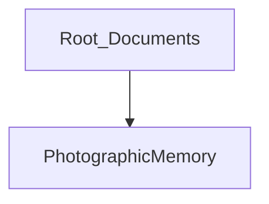

## Stack

- Not a code project. No manifest (package.json/go.mod/pyproject.toml/Cargo.toml) present at repo root.
- Contents observed: PDF documents and image files (JPEG) plus a one-line README.md.
- No build, no dependencies, no entry point.

## Directory map

| path | what lives there |
|---|---|
| `README.md` | Repo title only ("# CheatSheets"), no further content |
| `GitHub CheatSheets.pdf` | PDF document (root) |
| `Claude SKILLS.pdf` | PDF document (root) |
| `MERN GUIDE.pdf` | PDF document (root) |
| `PhotographicMemory/` | Folder of PDFs and JPEG images |
| `PhotographicMemory/loop Enginnering.jpeg` | Image file |
| `PhotographicMemory/selling style.jpeg` | Image file |
| `PhotographicMemory/Data Analysis.pdf` | PDF document |
| `PhotographicMemory/OpenGL_GLUT_Notes.pdf` | PDF document |

## Diagram

## Component index

- [[Root_Documents]]
- [[PhotographicMemory]]

## Entry points

- No dev entry point: not a runnable project.
- No prod entry point: not a runnable project.

## Conventions

- Files are named descriptively with spaces (e.g. "GitHub CheatSheets.pdf", "loop Enginnering.jpeg") as observed in the tree listing.
- Mixed casing and a typo in "Enginnering.jpeg" observed as-is; not corrected here.

## Where things go

- To add a new cheat sheet at the repo root, drop a PDF/document file beside the existing root PDFs.
- To add a new item to the PhotographicMemory collection, place the file inside `PhotographicMemory/`.
- To document repo purpose, expand `README.md` (currently only a title).
